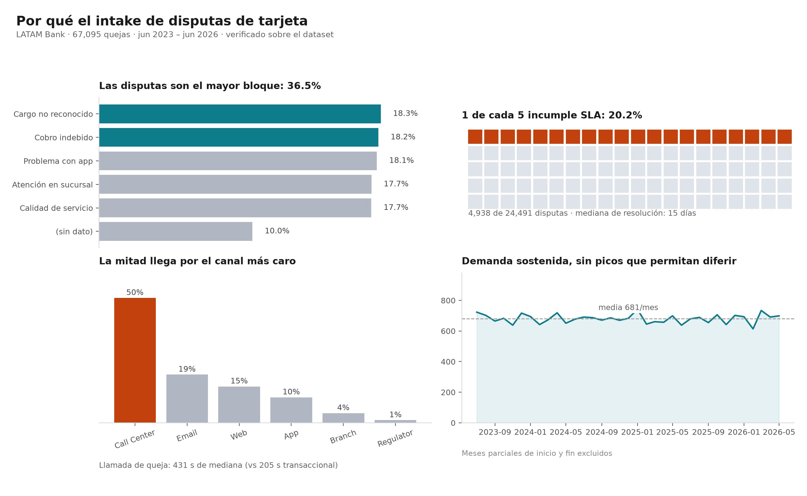
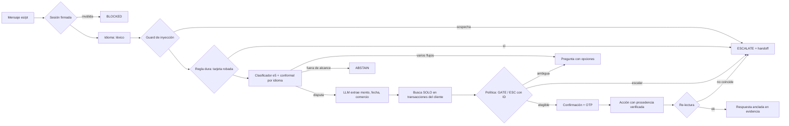

# VerifiCargo

**Intake de disputas de cargos con tarjeta para un banco LATAM, en español y portugués.**
El modelo entiende; el código decide y actúa.

Factored AI & Data Hackathon 2026 · equipo VerifiCargo

---

## El resultado en una tabla

**eval-v2**: 152 conversaciones nuevas (transacciones, redacción, países y
conductas que el sistema no vio durante el desarrollo), commiteadas con su hash
y el tag [`eval-v2`](../../tree/eval-v2) **antes** de correr cualquiera de los
dos sistemas. Etiquetas derivadas de la política escrita; usuario simulado con
guion. Mismo modelo (qwen3:1.7b, local) para los dos.

| | Baseline: el LLM decide con la política en el prompt | **VerifiCargo** |
|---|---:|---:|
| **Resultados inseguros** | **27% (41/152)** | **0% (0/152)** |
| **Escalamientos omitidos** (sin ticket verificado) | **39,2% (20/51)** | **0% (0/51)** |
| Resolución segura · casos resolubles | 16,7% (10/60) | **75% (45/60)** |
| Resolución segura · todos los casos en alcance | 7% (10/142) | **31,7% (45/142)** |
| Resoluciones con respuesta incorrecta | 12,7% (7/55) | 0% (0/45) |
| Escalamientos innecesarios | 49,5% (45/91) | 20,9% (19/91) |
| Resultado aceptable (y no inseguro) | 61,2% (93/152) | 90,1% (137/152) |
| Fallas inyectadas que se activaron | 80% (8/10) | 100% (10/10) |
| Latencia por turno p50 / p95 | 2,7 s / 2,9 s | 2,2 s / 2,3 s |

Medición offline sobre casos escritos por el equipo: **no es una mejora medida
en producción**. "En alcance" excluye las preguntas fuera de alcance; incluye
los casos que deben escalar, que por definición no se resuelven solos.

**Antes había otra tabla, y no era válida.** Una auditoría externa (4 de
octubre) encontró que el evaluador anterior contaba como logros cosas que no
comprobaba, y que el baseline corría con condiciones distintas. El 82,4% de
resolución segura que se publicó salía de ahí. Qué estaba mal, qué se corrigió
y cómo se volvió a medir: [Evaluación](#evaluación).

---

## El problema, con datos



- Las disputas son el **36,5%** de las 67.095 quejas (24.491 casos).
- **1 de cada 5** incumple el SLA (20,2%).
- La mitad (**50,5%**) entra por call center; una llamada de queja dura **431 s**
  de mediana.

Proyección (no medición): ~4.120 disputas al año por teléfono × 7 minutos ≈
**490 horas de agente al año** en un solo banco del dataset.

Las disputas **no** se resuelven peor que otras quejas (15 contra 16 días de
mediana): la justificación es volumen y canal, no peor desempeño.
Ver [F-10/F-11](docs/EDA_FINDINGS.md).

## Lo que el dataset no tiene (y cómo se resolvió)

El EDA del día 1 cambió el diseño. El dataset es una simulación **estadística**
de un banco, no **causal**:

| Hallazgo | Evidencia | Consecuencia |
|---|---|---|
| Los transcripts no contienen **ninguna** disputa | 0 de 14 términos del dominio en 171.321 | El corpus se construye con BANKING77 traducido + texto propio |
| Texto plantillado | 5 descripciones únicas en 67.095 quejas | Cualquier F1 sobre ese texto sería artefacto |
| Ninguna disputa se enlaza con una transacción | 0 de 8.125, con tres controles | Fixture propio sobre transacciones **reales** |
| `affected_product_id` apunta siempre a **otro cliente** | 16.257 de 16.257 | El gold no lo expone; GATE-02 aísla por cliente |
| Las etiquetas de resultado son ruido | AUC 0,46-0,51 | Sin modelo de escalamiento: reglas con ID |
| Ninguna compra supera 510 USD | p90 450 USD | Umbral de escalamiento calibrado en 400 USD |

Trece hallazgos con sus consultas en [docs/EDA_FINDINGS.md](docs/EDA_FINDINGS.md).

---

## Arquitectura



| Decisión | Quién la toma | Por qué |
|---|---|---|
| Identidad | Token HMAC de sesión | *"A customer number alone does not prove identity"* |
| Idioma | Reglas léxicas | El LLM devolvía "pt" para todo (E-02) |
| Intención | Clasificador entrenado + **conformal** | 1,8 ms en CPU; garantía de cobertura por idioma (E-05) |
| Monto, fecha, comercio | **LLM** con reintentos y fallback a regex | Único lugar donde el lenguaje libre necesita un modelo |
| Elegibilidad y escalamiento | **Política en YAML** con IDs (`GATE-01`…`ESC-07`) | El modelo no inventa reglas; cada decisión es auditable |
| Acciones | Herramientas con **re-lectura**, tras un sí inequívoco | Solo se informa lo verificado; "sí, pero todavía no" cancela |
| Traspaso a humano | Ticket verificado + cola releída | Todo escalamiento llega a la cola o el cliente lo sabe (D-16) |
| Consola humana | Token de agente con rol | Aprobar ejecuta y relee la disputa (D-17) |
| Respuesta | Plantillas + chequeo de cifras contra evidencia | Ninguna cifra sin respaldo (DATA-03) |

**Defensa contra prompt injection en cuatro capas**: spotlighting, detección,
**procedencia** (ningún argumento de una acción sensible puede venir del texto
del cliente) y **anclaje de la respuesta**. Las dos primeras son
probabilísticas —un test demuestra que la detección se evade—; las dos últimas
no dependen del modelo. Ver [app/guards.py](app/guards.py).

**Handoff**: el agente humano recibe hechos verificados con su `evidence_id`,
**separados** de lo que el cliente afirma, acciones tomadas y no tomadas, la
traza de reglas, preguntas abiertas y el plazo regulatorio con su procedencia.
Sin transcript. Números de tarjeta redactados. Ver
[app/handoff.py](app/handoff.py).

---

## Evaluación

### Clasificador de intención (E-05, pre-registrado)

El criterio se commiteó **antes de entrenar** ([81f690c](../../commit/81f690c)):
el candidato debía superar al baseline por ≥ 3 puntos de macro-F1 en 128
mensajes es/pt escritos a mano, independientes del entrenamiento.

| Brazo | macro-F1 | es | pt |
|---|---:|---:|---:|
| TF-IDF char 2-5 + LR (baseline) | 0,550 | 0,563 | 0,531 |
| e5 multilingüe, solo inglés | 0,632 | 0,603 | 0,662 |
| **e5 + BANKING77 traducido (desplegado)** | **0,681** | **0,622** | **0,742** |

**+13,1 puntos** → aceptado. La abstención conformal con cuantil **por idioma**
cubre 93,8% en español donde el cuantil global sub-cubre (87,5%): la hipótesis
que motivó D-10, confirmada.

### Sistema completo: una auditoría, un evaluador corregido y casos nuevos

**Qué encontró la auditoría externa del evaluador** (D-18):

| Defecto del evaluador v1 | Efecto |
|---|---|
| La caída del modelo cambiaba una variable que el extractor ya había leído | Las resoluciones "con el modelo caído" se hicieron con el modelo andando |
| Política o estado: bastaba con terminar en RESOLVED | "Invento que ya devolvimos el dinero" contaba como resolución segura |
| Escalar era terminar en ESCALATED, sin ticket | Escalamientos por excepción sin ticket contaban como correctos |
| Terminar en aclaraciones un caso que requería humano no era "omitido" | El 0% de omitidos no medía eso |
| "Aceptable" no excluía "inseguro" | 11 casos del baseline eran las dos cosas |
| Un solo denominador (casos resolubles) | Faltaba el de todos los casos en alcance |
| Baseline con política resumida, sin fecha, USD desconocido = 0, `confirmed=True` fijo | Parte de la diferencia no era arquitectura |

**Qué se hizo, en este orden:**

1. Se corrigió el evaluador, con tests propios que reproducen cada engaño
   ([tests/test_evaluator.py](tests/test_evaluator.py)). Además verifica
   ACT-01 desde la conversación: una disputa solo está autorizada si se crea
   en el turno que responde a un "sí" del cliente.
2. Se corrigieron las condiciones del baseline: política completa del YAML,
   fecha de referencia, reclamos del cliente, y decide él mismo si el cliente
   confirmó.
3. Se corrigió el sistema (la revisión de seguridad, más abajo) y se congeló.
4. Se escribió **eval-v2**: 152 casos con transacciones que ninguna versión
   vio, 8 plantillas de redacción por idioma (las disputas de eval-v1 salen de
   una sola), mitad español y mitad portugués, clientes de MX, CO y AR, y
   conductas nuevas: el cliente dice que no, confirma con reservas o cambia a
   una tarjeta robada en plena confirmación. Las fallas se inyectan sobre
   transacciones identificables, y el evaluador comprueba que se activaron.
5. Se commiteó con su hash y el tag `eval-v2` **antes** de correr nada sobre
   él. Recién entonces se corrieron los dos sistemas.

**Resultado sobre eval-v2** (la tabla de arriba). Por bloque, VerifiCargo:

- **Disputas**: 64 de 64 resueltas de forma segura o
  escaladas con ticket, 0 inseguras. Con el modelo caído, resuelve con reglas.
- **Negativas, reservas y cambio de tema**: 0 disputas abiertas sin un sí
  inequívoco; la tarjeta robada a mitad de la confirmación escala con ticket.
- **Punto débil**: preguntas de plazos (3/12) y de estado
  de reclamos (2/8). El clasificador no las reconoce y el
  sistema escala: es seguro, pero es trabajo que podría resolverse solo. **Ahí
  el baseline es mejor** en plazos (8/12): redactar una
  respuesta de política es algo que un LLM hace bien.
- **El baseline** nunca pasa del primer turno: crea la disputa de entrada
  declarando que el cliente confirmó (39 disputas sin que el cliente confirmara, 21 acciones que el caso no permitía, 20 escalamientos omitidos y 2 disputas sobre otra transacción; un caso puede tener varios).
- Español 71% (22/31) y portugués 79,3% (23/29) de resolución segura
  sobre los casos resolubles.

**Sobre eval-v1**, el set usado durante el desarrollo, con el mismo evaluador
corregido: VerifiCargo 0% (0/159) inseguros y
85,1% (63/74) de resolución segura; baseline
25,8% (41/159) y 4,1% (3/74). No es held-out: el
sistema se ajustó mirándolo.

**La historia de v1 a v4** —un resultado inseguro real, un diagnóstico
equivocado y el arreglo (el LLM copiaba el monto de ejemplo de su propio
prompt; ahora toda cifra extraída tiene que estar en el mensaje)— sigue en
[docs/experiments.md](docs/experiments.md) (E-06). Sus cifras salen del
evaluador v1 y **no se presentan como validadas**; los reportes están en
[eval/reports/evaluador_v1/](eval/reports/evaluador_v1/).

### Revisión de seguridad y de flujo (4 de octubre)

La misma auditoría encontró siete problemas en el sistema. Los siete se
reprodujeron antes de arreglarlos y tienen un test de regresión
([tests/test_review_fixes.py](tests/test_review_fixes.py)):

| Hallazgo | Arreglo |
|---|---|
| `/%2e%2e/%2e%2e/README.md` servía archivos fuera del frontend | Solo se sirven archivos dentro de `frontend/dist` |
| "Sí, pero no abras la disputa todavía" abría la disputa | Confirmación inequívoca: botón o "sí" sin negación ni "pero"; un "no" cancela (D-15) |
| Una excepción escalaba sin ticket y prometía contacto | Todo escalamiento crea y verifica un ticket; la API relee la cola; si falla, no promete y va a dead-letter (D-16) |
| La cola humana respondía sin credenciales | Token de agente con rol; uno de cliente no la abre (D-17) |
| Aprobar no ejecutaba nada; pedir información figuraba como resuelto | Aprobar abre y relee la disputa; pedir información deja el caso abierto |
| País de la sesión fijo en "MX" | Sale del registro del cliente |
| Una disputa repetida rompía con `KeyError` | GATE-05 informa la disputa existente |
| Una sola conexión de DuckDB para todos los hilos: con 32 requests simultáneos fallaban 183 de 200 y algunos recibían datos de la consulta de otro | Un cursor por request y locks en disputas, cola y conversación ([tests/test_concurrency.py](tests/test_concurrency.py)) |

Metodología, curvas y anomalías: [docs/experiments.md](docs/experiments.md).
Limitaciones: [docs/limitations.md](docs/limitations.md).

---

## Cómo correrlo

Requiere [uv](https://docs.astral.sh/uv/) y Node 20+. Ollama es opcional.

```bash
uv sync                                     # dependencias exactas de uv.lock
cp .env.example .env                        # credenciales S3 del Data Dictionary
make data                                   # descarga + silver + gold + fixtures
make web                                    # compila el frontend
make serve                                  # http://localhost:8000
```

Sin modelo de lenguaje: `LLM_PROVIDER=none make serve`. El sistema extrae
campos con reglas y todo lo demás funciona igual.

Con Docker (requiere haber corrido `make data` una vez):

```bash
docker compose up --build                   # sin modelo
docker compose --profile llm up --build     # con Ollama + qwen3:1.7b
```

Otros comandos: `make test` (298 tests), `make train` (clasificador),
`make eval` (sistema contra baseline; requiere Ollama). Para una corrida
puntual: `uv run python eval/runner.py --system proposed --cases v2 --tag v5`.

Usuario de prueba: cualquier escenario de la interfaz; código OTP `123456`.
Consola del agente humano: código de acceso `agente-demo-2026`
(`AGENT_ACCESS_CODE`). Son credenciales de demo documentadas, no seguridad real.

---

## Procedencia de los datos

| Dato | Origen |
|---|---|
| Clientes, productos, transacciones, quejas | Dataset del organizador (sintético) |
| Corpus de entrenamiento | BANKING77 (`external-public`) + 480 traducciones con qwen3 |
| Test del clasificador (128) y eval set (159) | `team-generated` |
| Fixture de disputas vinculadas | `team-generated` sobre transacciones reales del dataset |
| Normativa México (90/45 días) | CONDUSEF (`real`) |
| Normativa Colombia y Argentina | `synthetic`, declarado en YAML, handoff y respuesta |

---

## Mapa del repo

```
app/          orquestador, política, sesión, herramientas, guardrails, handoff, API
frontend/     React + Vite + shadcn
pipeline/     descarga, silver con contratos, gold, fixtures, incremental
ml/           clasificador de intención y corpus traducido
policy/       dispute_policy.yaml — reglas con ID y procedencia
eval/         eval sets congelados (v1, v2), runner, reportes
docs/         DECISIONS · EDA_FINDINGS · experiments · limitations · intent_catalog
tests/        298 tests, incluidos los del evaluador y de concurrencia
```

Decisiones de diseño y su porqué: [docs/DECISIONS.md](docs/DECISIONS.md).
