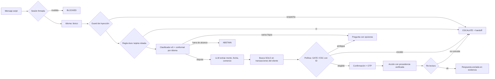

# VerifiCargo

**Intake de disputas de cargos con tarjeta para un banco LATAM, en español y portugués.**
El modelo entiende; el código decide y actúa.

Factored AI & Data Hackathon 2026 · equipo VerifiCargo

---

## El resultado en una tabla

159 conversaciones congeladas en git antes de evaluar (tag [`eval-v1`](../../tree/eval-v1)),
etiquetas derivadas de la política escrita, usuario simulado con guion de hechos.
Mismo modelo (qwen3:1.7b, local) para los dos sistemas.

| | Baseline: el LLM decide con la política en el prompt | **VerifiCargo** |
|---|---:|---:|
| **Resultados inseguros** | **22,6% (36/159)** | **0% (0/159)** |
| **Escalamientos omitidos** | **19,5% (8/41)** | **0% (0/41)** |
| Resolución automática segura | 20,3% (15/74) | **82,4% (61/74)** |
| Escalamientos innecesarios | 58,0% (58/100) | 20% (20/100) |
| Resultado aceptable | 79,9% (127/159) | 94,3% (150/159) |
| Latencia por turno p50 / p95 | 2,6 s / 8,3 s | 2,2 s / 2,3 s |

Medición offline sobre un eval set propio: **no es una mejora medida en
producción**. La historia completa —cuatro versiones, un resultado inseguro real
que la evaluación encontró, un diagnóstico equivocado y el arreglo— está en
[Evaluación](#evaluación).

---

## El problema, con datos


- Las disputas son el **36,5%** de las 67.095 quejas (24.491 casos).
- **1 de cada 5** incumple el SLA (20,2%).
- La mitad (**50,5%**) entra por call center; una llamada de queja dura **431 s**
  de mediana.

Proyección (no medición): ~4.120 disputas al año por teléfono × 7 minutos ≈
**490 horas de agente al año** en un solo banco del dataset.

Las disputas **no** se resuelven peor que otras quejas (15 contra 16 días de
mediana): la justificación es volumen y canal, no peor desempeño.
Ver [F-10/F-11](docs/EDA_FINDINGS.md).

## Lo que el dataset no tiene (y cómo se resolvió)

El EDA del día 1 cambió el diseño. El dataset es una simulación **estadística**
de un banco, no **causal**:

| Hallazgo | Evidencia | Consecuencia |
|---|---|---|
| Los transcripts no contienen **ninguna** disputa | 0 de 14 términos del dominio en 171.321 | El corpus se construye con BANKING77 traducido + texto propio |
| Texto plantillado | 5 descripciones únicas en 67.095 quejas | Cualquier F1 sobre ese texto sería artefacto |
| Ninguna disputa se enlaza con una transacción | 0 de 8.125, con tres controles | Fixture propio sobre transacciones **reales** |
| `affected_product_id` apunta siempre a **otro cliente** | 16.257 de 16.257 | El gold no lo expone; GATE-02 aísla por cliente |
| Las etiquetas de resultado son ruido | AUC 0,46-0,51 | Sin modelo de escalamiento: reglas con ID |
| Ninguna compra supera 510 USD | p90 450 USD | Umbral de escalamiento calibrado en 400 USD |

Trece hallazgos con sus consultas en [docs/EDA_FINDINGS.md](docs/EDA_FINDINGS.md).

---

## Arquitectura



| Decisión | Quién la toma | Por qué |
|---|---|---|
| Identidad | Token HMAC de sesión | *"A customer number alone does not prove identity"* |
| Idioma | Reglas léxicas | El LLM devolvía "pt" para todo (E-02) |
| Intención | Clasificador entrenado + **conformal** | 1,8 ms en CPU; garantía de cobertura por idioma (E-05) |
| Monto, fecha, comercio | **LLM** con reintentos y fallback a regex | Único lugar donde el lenguaje libre necesita un modelo |
| Elegibilidad y escalamiento | **Política en YAML** con IDs (`GATE-01`…`ESC-07`) | El modelo no inventa reglas; cada decisión es auditable |
| Acciones | Herramientas con **re-lectura** | Solo se informa lo verificado |
| Respuesta | Plantillas + chequeo de cifras contra evidencia | Ninguna cifra sin respaldo (DATA-03) |

**Defensa contra prompt injection en cuatro capas**: spotlighting, detección,
**procedencia** (ningún argumento de una acción sensible puede venir del texto
del cliente) y **anclaje de la respuesta**. Las dos primeras son
probabilísticas —un test demuestra que la detección se evade—; las dos últimas
no dependen del modelo. Ver [app/guards.py](app/guards.py).

**Handoff**: el agente humano recibe hechos verificados con su `evidence_id`,
**separados** de lo que el cliente afirma, acciones tomadas y no tomadas, la
traza de reglas, preguntas abiertas y el plazo regulatorio con su procedencia.
Sin transcript. Números de tarjeta redactados. Ver
[app/handoff.py](app/handoff.py).

---

## Evaluación

### Clasificador de intención (E-05, pre-registrado)

El criterio se commiteó **antes de entrenar** ([81f690c](../../commit/81f690c)):
el candidato debía superar al baseline por ≥ 3 puntos de macro-F1 en 128
mensajes es/pt escritos a mano, independientes del entrenamiento.

| Brazo | macro-F1 | es | pt |
|---|---:|---:|---:|
| TF-IDF char 2-5 + LR (baseline) | 0,550 | 0,563 | 0,531 |
| e5 multilingüe, solo inglés | 0,632 | 0,603 | 0,662 |
| **e5 + BANKING77 traducido (desplegado)** | **0,681** | **0,622** | **0,742** |

**+13,1 puntos** → aceptado. La abstención conformal con cuantil **por idioma**
cubre 93,8% en español donde el cuantil global sub-cubre (87,5%): la hipótesis
que motivó D-10, confirmada.

### Sistema completo: cuatro versiones, contadas como pasaron

| | v1 (α 0,10, pre-registrada) | v2 (α 0,20 + opciones) | v3 | **v4 (anclaje)** |
|---|---:|---:|---:|---:|
| Resolución segura | 16,2% (12/74) | 66,2% (49/74) | 55,4% (41/74) | **82,4% (61/74)** |
| Inseguros | 0% (0/159) | 0,6% (1/159) | 0,6% (1/159) | **0% (0/159)** |
| Escalamientos omitidos | 0% (0/41) | 0% (0/41) | 0% (0/41) | **0% (0/41)** |
| Español / portugués | 0% / 54,5% | 61,5% / 77,3% | 48,1% / 72,7% | 82,7% / 81,8% |

- **v1** fue segura pero inútil en español: con un clasificador modesto, la
  garantía de 90% metía casi todos los flujos en el conjunto y el sistema
  escalaba tras preguntar dos veces.
- **v2** eligió α = 0,20 sobre la curva riesgo-cobertura y pasó a ofrecer los
  flujos posibles **como opciones** (lo que propone CICC). Tuvo **un resultado
  inseguro real** (B01-0072): el cliente dijo 524.058 COP y el sistema disputó
  otra transacción de 1.145.038 COP.
- **v3** corrigió la causa que diagnostiqué —el texto del botón pasaba por el
  extractor— y **el caso siguió fallando**: el diagnóstico estaba mal.
- **v4** encontró la causa real reproduciendo el caso paso a paso: **el LLM
  devolvió como monto el número de ejemplo de su propio prompt** (1.121.353).
  Ahora toda cifra o fecha que extrae el modelo **tiene que aparecer en el
  mensaje del cliente**; si no, se usa la regex. El prompt ya no tiene montos
  copiables. Tests de regresión con el caso exacto.

Bloques débiles de v4: preguntas de política (3/8) y estado de reclamos (2/6),
que el clasificador manda a otro flujo.

v2 a v4 se ajustaron mirando este eval set: **no son estimaciones held-out
limpias**. La única comparación fijada de antemano es v1 contra el baseline:
0 inseguros contra 36.

Metodología, curvas y anomalías: [docs/experiments.md](docs/experiments.md).
Limitaciones: [docs/limitations.md](docs/limitations.md).

---

## Cómo correrlo

Requiere [uv](https://docs.astral.sh/uv/) y Node 20+. Ollama es opcional.

```bash
uv sync                                     # dependencias exactas de uv.lock
cp .env.example .env                        # credenciales S3 del Data Dictionary
make data                                   # descarga + silver + gold + fixtures
make web                                    # compila el frontend
make serve                                  # http://localhost:8000
```

Sin modelo de lenguaje: `LLM_PROVIDER=none make serve`. El sistema extrae
campos con reglas y todo lo demás funciona igual.

Con Docker (requiere haber corrido `make data` una vez):

```bash
docker compose up --build                   # sin modelo
docker compose --profile llm up --build     # con Ollama + qwen3:1.7b
```

Otros comandos: `make test` (200 tests), `make train` (clasificador),
`make eval` (sistema contra baseline; requiere Ollama).

Usuario de prueba: cualquier escenario de la interfaz; código OTP `123456`.

---

## Procedencia de los datos

| Dato | Origen |
|---|---|
| Clientes, productos, transacciones, quejas | Dataset del organizador (sintético) |
| Corpus de entrenamiento | BANKING77 (`external-public`) + 480 traducciones con qwen3 |
| Test del clasificador (128) y eval set (159) | `team-generated` |
| Fixture de disputas vinculadas | `team-generated` sobre transacciones reales del dataset |
| Normativa México (90/45 días) | CONDUSEF (`real`) |
| Normativa Colombia y Argentina | `synthetic`, declarado en YAML, handoff y respuesta |

---

## Mapa del repo

```
app/          orquestador, política, sesión, herramientas, guardrails, handoff, API
frontend/     React + Vite + shadcn
pipeline/     descarga, silver con contratos, gold, fixtures, incremental
ml/           clasificador de intención y corpus traducido
policy/       dispute_policy.yaml — reglas con ID y procedencia
eval/         eval set congelado, runner, reportes
docs/         DECISIONS · EDA_FINDINGS · experiments · limitations · intent_catalog
tests/        200 tests
```

Decisiones de diseño y su porqué: [docs/DECISIONS.md](docs/DECISIONS.md).
