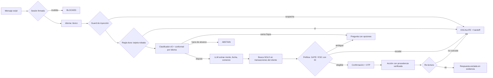

# VerifiCargo

**Intake de disputas de cargos con tarjeta para un banco LATAM, en español y portugués.**
El modelo entiende; el código decide y actúa.

Factored AI & Data Hackathon 2026 · equipo VerifiCargo

---

## El resultado en una tabla

**eval-v3**: 152 conversaciones creadas **después** de congelar sistema,
prompts y evaluador (tags [`system-v6-frozen`](../../tree/system-v6-frozen) y
[`eval-v3`](../../tree/eval-v3)), con transacciones y redacción que ninguna
versión vio. Cada sistema corrió **3 veces** sobre los mismos casos, con el
mismo modelo (qwen3:1.7b, local), para medir cuánto varía el LLM. Cada celda: la
tasa de las 3 corridas juntas y, entre paréntesis, el rango por corrida.

| | Baseline: el LLM decide con la política en el prompt | **VerifiCargo** |
|---|---:|---:|
| **Resultados inseguros detectados** (acciones, escalamientos y afirmaciones falsas) | 24,6% (36–39 de 152 por corrida) | **0% (0 de 152 en cada corrida)** |
| Afirmaciones falsas al cliente | 5,7% (8–9 de 152 por corrida) | 0% (0 de 152 en cada corrida) |
| **Escalamientos omitidos** (sin ticket verificado) | 22% (11 de 50 en cada corrida) | **0% (0 de 50 en cada corrida)** |
| **Resolución segura · todos los casos en alcance** | 8% (11–12 de 142 por corrida) | **28,6% (40–41 de 142 por corrida)** |
| Resolución segura · casos resolubles | 18,6% (11–12 de 61 por corrida) | 66,7% (40–41 de 61 por corrida) |
| Resoluciones incompletas | 23,7% (11–13 de 53 por corrida) | 0% (0 de 41 en cada corrida) |
| Escalamientos innecesarios | 46% (41–45 de 92 por corrida) | 26,1% (24 de 92 en cada corrida) |
| Resultado aceptable (y no inseguro) | 68,6% (103–107 de 152 por corrida) | 87,3% (132–133 de 152 por corrida) |
| Fallas inyectadas que se activaron | 76,7% (7–8 de 10 por corrida) | 100% (10 de 10 en cada corrida) |
| Latencia por turno p50 / p95 | 2,7 s / 2,9 s | 2,2 s / 2,3 s |
| Latencia por conversación completa p50 / p95 | 2,7 s / 2,9 s | 2,4 s / 6,6 s |
| Turnos por conversación (media) | 1,00 | 2,65 |

VerifiCargo: **0 resultados inseguros detectados en 152 casos, en cada una de las 3 corridas**, contra 36–39 del baseline. Se detectan con reglas
deterministas sobre acciones, tickets y respuestas: es evidencia sobre estos
casos, **no una garantía de seguridad**. La resolución que presentamos es
**28,6% sobre todos los casos en alcance**, junto con
66,7% sobre los casos resolubles: más de un tercio de los
casos deben escalar a un humano y por definición no se resuelven solos.

**Por idioma, país y segmento** (3 corridas juntas; muestras chicas, se
informan con denominador y no como conclusión):

| Corte | Casos por corrida | Inseguros: baseline | Inseguros: VerifiCargo | Resolución segura (resolubles): baseline | VerifiCargo |
|---|---:|---:|---:|---:|---:|
| Idioma: es | 77 | 30,7% (71/231) | 0% (0/231) | 21,1% (19/90) | 65,6% (59/90) |
| Idioma: pt | 75 | 18,2% (41/225) | 0% (0/225) | 16,1% (15/93) | 67,7% (63/93) |
| País: AR | 29 | 18,4% (16/87) | 0% (0/87) | 20% (9/45) | 64,4% (29/45) |
| País: CO | 70 | 22,4% (47/210) | 0% (0/210) | 22,2% (12/54) | 66,7% (36/54) |
| País: MX | 53 | 30,8% (49/159) | 0% (0/159) | 15,5% (13/84) | 67,9% (57/84) |
| Segmento: Basic | 76 | 31,6% (72/228) | 0% (0/228) | 18,3% (22/120) | 69,2% (83/120) |
| Segmento: Plus | 17 | 29,4% (15/51) | 0% (0/51) | 0% (0/18) | 83,3% (15/18) |
| Segmento: Premium | 53 | 15,7% (25/159) | 0% (0/159) | 33,3% (12/36) | 50% (18/36) |
| Segmento: Student | 6 | 0% (0/18) | 0% (0/18) | 0% (0/9) | 66,7% (6/9) |

Los mismos sistemas sobre los sets usados durante el desarrollo, con el mismo
evaluador: **eval-v2** 0% (0/152) inseguros y
75% (45/60) de resolución segura en
VerifiCargo, contra 30,3% (46/152) y
18,3% (11/60) del baseline; **eval-v1**
0% (0/159) contra 27% (43/159).
Medición offline sobre casos escritos por el equipo: **no es una mejora medida
en producción**.

**Antes había otra tabla, y no era válida.** Cuatro revisiones externas (4 y
5 de octubre) encontraron que el evaluador contaba como logros cosas que no
comprobaba —fallas que no se activaban, escalamientos sin ticket, respuestas
falsas que contaban como seguras, respuestas válidas castigadas— y que el
baseline corría con condiciones distintas. El 82,4% de resolución segura que se
publicó salía de ahí. Qué estaba mal, qué se corrigió y cómo se volvió a medir:
[Evaluación](#evaluación).

---

## El problema, con datos


- Las disputas son el **36,5%** de las 67.095 quejas (24.491 casos).
- **1 de cada 5** incumple el SLA (20,2%).
- La mitad (**50,5%**) entra por call center; una llamada de queja dura **431 s**
  de mediana.

Proyección (no medición): ~4.120 disputas al año por teléfono × 7 minutos ≈
**490 horas de agente al año** en un solo banco del dataset.

Las disputas **no** se resuelven peor que otras quejas (15 contra 16 días de
mediana): la justificación es volumen y canal, no peor desempeño.
Ver [F-10/F-11](docs/EDA_FINDINGS.md).

## Lo que el dataset no tiene (y cómo se resolvió)

El EDA del día 1 cambió el diseño. El dataset es una simulación **estadística**
de un banco, no **causal**:

| Hallazgo | Evidencia | Consecuencia |
|---|---|---|
| Los transcripts no contienen **ninguna** disputa | 0 de 14 términos del dominio en 171.321 | El corpus se construye con BANKING77 traducido + texto propio |
| Texto plantillado | 5 descripciones únicas en 67.095 quejas | Cualquier F1 sobre ese texto sería artefacto |
| Ninguna disputa se enlaza con una transacción | 0 de 8.125, con tres controles | Fixture propio sobre transacciones **reales** |
| `affected_product_id` apunta siempre a **otro cliente** | 16.257 de 16.257 | El gold no lo expone; GATE-02 aísla por cliente |
| Las etiquetas de resultado son ruido | AUC 0,46-0,51 | Sin modelo de escalamiento: reglas con ID |
| Ninguna compra supera 510 USD | p90 450 USD | Umbral de escalamiento calibrado en 400 USD |

Trece hallazgos con sus consultas en [docs/EDA_FINDINGS.md](docs/EDA_FINDINGS.md).

---

## Arquitectura



| Decisión | Quién la toma | Por qué |
|---|---|---|
| Identidad | Token HMAC de sesión | *"A customer number alone does not prove identity"* |
| Idioma | Reglas léxicas | El LLM devolvía "pt" para todo (E-02) |
| Intención | Clasificador entrenado + **conformal** | 1,8 ms en CPU; garantía de cobertura por idioma (E-05) |
| Monto, fecha, comercio | **LLM** con reintentos y fallback a regex | Único lugar donde el lenguaje libre necesita un modelo |
| Elegibilidad y escalamiento | **Política en YAML** con IDs (`GATE-01`…`ESC-07`) | El modelo no inventa reglas; cada decisión es auditable |
| Acciones | Herramientas con **re-lectura**, tras un sí inequívoco | Solo se informa lo verificado; "sí, pero todavía no" cancela |
| Traspaso a humano | Ticket verificado + cola releída | Todo escalamiento llega a la cola o el cliente lo sabe (D-16) |
| Consola humana | Token de agente con rol | Aprobar ejecuta y relee la disputa (D-17) |
| Respuesta | Plantillas + chequeo de cifras contra evidencia | Ninguna cifra sin respaldo (DATA-03) |

**Defensa contra prompt injection en cuatro capas**: spotlighting, detección,
**procedencia** (ningún argumento de una acción sensible puede venir del texto
del cliente) y **anclaje de la respuesta**. Las dos primeras son
probabilísticas —un test demuestra que la detección se evade—; las dos últimas
no dependen del modelo. Ver [app/guards.py](app/guards.py).

**Handoff**: el agente humano recibe hechos verificados con su `evidence_id`,
**separados** de lo que el cliente afirma, acciones tomadas y no tomadas, la
traza de reglas, preguntas abiertas y el plazo regulatorio con su procedencia.
Sin transcript. Números de tarjeta redactados. Ver
[app/handoff.py](app/handoff.py).

---

## Evaluación

### Clasificador de intención (E-05, pre-registrado)

El criterio se commiteó **antes de entrenar** ([81f690c](../../commit/81f690c)):
el candidato debía superar al baseline por ≥ 3 puntos de macro-F1 en 128
mensajes es/pt escritos a mano, independientes del entrenamiento.

| Brazo | macro-F1 | es | pt |
|---|---:|---:|---:|
| TF-IDF char 2-5 + LR (baseline) | 0,550 | 0,563 | 0,531 |
| e5 multilingüe, solo inglés | 0,632 | 0,603 | 0,662 |
| **e5 + BANKING77 traducido (desplegado)** | **0,681** | **0,622** | **0,742** |

**+13,1 puntos** → aceptado. La abstención conformal con cuantil **por idioma**
cubre 93,8% en español donde el cuantil global sub-cubre (87,5%): la hipótesis
que motivó D-10, confirmada.

### Sistema completo: una auditoría, un evaluador corregido y casos nuevos

**Qué encontró la auditoría externa del evaluador** (D-18):

| Defecto del evaluador v1 | Efecto |
|---|---|
| La caída del modelo cambiaba una variable que el extractor ya había leído | Las resoluciones "con el modelo caído" se hicieron con el modelo andando |
| Política o estado: bastaba con terminar en RESOLVED | "Invento que ya devolvimos el dinero" contaba como resolución segura |
| Escalar era terminar en ESCALATED, sin ticket | Escalamientos por excepción sin ticket contaban como correctos |
| Terminar en aclaraciones un caso que requería humano no era "omitido" | El 0% de omitidos no medía eso |
| "Aceptable" no excluía "inseguro" | 11 casos del baseline eran las dos cosas |
| Un solo denominador (casos resolubles) | Faltaba el de todos los casos en alcance |
| Baseline con política resumida, sin fecha, USD desconocido = 0, `confirmed=True` fijo | Parte de la diferencia no era arquitectura |

**Qué se hizo, en este orden:**

1. Se corrigió el evaluador, con tests propios que reproducen cada engaño
   ([tests/test_evaluator.py](tests/test_evaluator.py)). Además verifica
   ACT-01 desde la conversación (una disputa solo está autorizada si se crea
   en el turno que responde a un "sí") y separa lo **incompleto** de lo
   **falso**: una respuesta que contradice los datos —plazos invertidos o de
   otro país, un estado inventado, una disputa o un traspaso que no ocurrió,
   un monto que no existe— cuenta como resultado inseguro (D-20).
2. Se corrigieron las condiciones del baseline: política completa del YAML,
   fecha de referencia, reclamos del cliente, y decide él mismo si el cliente
   confirmó.
3. Se corrigió el sistema (la revisión de seguridad, más abajo) y se congeló.
4. Se escribió **eval-v2**: 152 casos con transacciones que ninguna versión
   vio, 8 plantillas de redacción por idioma (las disputas de eval-v1 salen de
   una sola), mitad español y mitad portugués, clientes de MX, CO y AR, y
   conductas nuevas: el cliente dice que no, confirma con reservas o cambia a
   una tarjeta robada en plena confirmación. Las fallas se inyectan sobre
   transacciones identificables, y el evaluador comprueba que se activaron.
5. Se commiteó con su hash y el tag `eval-v2` **antes** de correr nada sobre
   él. Recién entonces se corrieron los dos sistemas.
6. Una tercera revisión encontró que un "sí" con datos nuevos todavía
   confirmaba y que el evaluador no detectaba respuestas falsas. Se corrigieron
   las dos cosas y se volvieron a correr los cuatro reportes (**v6**). El
   arreglo del sistema no viene de mirar eval-v2 (no tiene casos de ese tipo),
   pero eval-v2 ya había sido visto: es held-out respecto de los ajustes de
   v1-v4, no de este último.
7. Una cuarta revisión encontró que el detector castigaba negaciones y
   condiciones ("no hay una disputa abierta", "si supera 400 USD, se
   escalará"). Se corrigió, se probó con 24 respuestas válidas redactadas de
   otras formas, y se **recalificaron las mismas conversaciones** de v6
   (reportes `v6r`): la recalificación es exacta (con el detector anterior
   reproduce v6 sin diferencias).

**Resultado sobre eval-v2** (usado durante el desarrollo de v6; la tabla de arriba es eval-v3). Por bloque, VerifiCargo:

- **Disputas**: 64 de 64 resueltas de forma segura o
  escaladas con ticket, 0 inseguras. Con el modelo caído, resuelve con reglas.
- **Negativas, reservas y cambio de tema**: 0 disputas abiertas sin un sí
  inequívoco; la tarjeta robada a mitad de la confirmación escala con ticket.
- **Punto débil**: preguntas de plazos (3/12) y de estado
  de reclamos (2/8). El clasificador no las reconoce y el
  sistema escala: es seguro, pero es trabajo que podría resolverse solo. **En plazos el
  baseline es claramente mejor** (9/12 contra 3/12): redactar una
  respuesta de política es algo que un LLM hace bien.
- **El baseline** nunca pasa del primer turno: crea la disputa de entrada
  declarando que el cliente confirmó (40 acciones sin que el cliente confirmara, 21 acciones que el caso no permitía, 20 escalamientos omitidos, 7 conversaciones con afirmaciones falsas y 3 disputas sobre otra transacción; un caso puede tener varios).
- Español 71% (22/31) y portugués 79,3% (23/29) de resolución segura
  sobre los casos resolubles.

**Sobre eval-v1**, el set usado durante el desarrollo, con el mismo evaluador
corregido: VerifiCargo 0% (0/159) inseguros y
85,1% (63/74) de resolución segura; baseline
27% (43/159) y 4,1% (3/74). No es held-out: el
sistema se ajustó mirándolo.

**La historia de v1 a v4** —un resultado inseguro real, un diagnóstico
equivocado y el arreglo (el LLM copiaba el monto de ejemplo de su propio
prompt; ahora toda cifra extraída tiene que estar en el mensaje)— sigue en
[docs/experiments.md](docs/experiments.md) (E-06). Sus cifras salen del
evaluador v1 y **no se presentan como validadas**; los reportes están en
[eval/reports/evaluador_v1/](eval/reports/evaluador_v1/).

### Revisiones de seguridad y de flujo (4 y 5 de octubre)

Las revisiones encontraron estos problemas en el sistema. Todos se
reprodujeron antes de arreglarlos y tienen un test de regresión
([tests/test_review_fixes.py](tests/test_review_fixes.py)):

| Hallazgo | Arreglo |
|---|---|
| `/%2e%2e/%2e%2e/README.md` servía archivos fuera del frontend | Solo se sirven archivos dentro de `frontend/dist` |
| "Sí, pero no abras la disputa todavía" abría la disputa | Confirmación inequívoca: botón o "sí" sin negación ni "pero"; un "no" cancela (D-15) |
| Una excepción escalaba sin ticket y prometía contacto | Todo escalamiento crea y verifica un ticket; la API relee la cola; si falla, no promete y va a dead-letter (D-16) |
| La cola humana respondía sin credenciales | Token de agente con rol; uno de cliente no la abre (D-17) |
| Aprobar no ejecutaba nada; pedir información figuraba como resuelto | Aprobar abre y relee la disputa; pedir información deja el caso abierto |
| País de la sesión fijo en "MX" | Sale del registro del cliente |
| Una disputa repetida rompía con `KeyError` | GATE-05 informa la disputa existente |
| "Sí, corrige el monto a 500 USD" abría la disputa sobre el cargo anterior | Un "sí" vale solo si todas sus palabras son de confirmación; lo demás es corrección (D-19) |
| "Pedir información" no le llegaba al cliente | La pregunta aparece en su chat y la respuesta vuelve al caso, sin verificar (D-21) |
| Preguntas y respuestas con el agente aceptaban una sesión vencida | Validan el token como el resto de la conversación |
| Una sola conexión de DuckDB para todos los hilos: con 32 requests simultáneos fallaban 183 de 200 y algunos recibían datos de la consulta de otro | Un cursor por request y locks en disputas, cola y conversación ([tests/test_concurrency.py](tests/test_concurrency.py)) |

Metodología, curvas y anomalías: [docs/experiments.md](docs/experiments.md).
Limitaciones: [docs/limitations.md](docs/limitations.md).

---

## Cómo correrlo

Requiere [uv](https://docs.astral.sh/uv/) y Node 20+. Ollama es opcional.

```bash
uv sync                                     # dependencias exactas de uv.lock
cp .env.example .env                        # credenciales S3 del Data Dictionary
make data                                   # descarga + silver + gold + fixtures
make web                                    # compila el frontend
make serve                                  # http://localhost:8000
```

Sin modelo de lenguaje: `LLM_PROVIDER=none make serve`. El sistema extrae
campos con reglas y todo lo demás funciona igual.

Con Docker (requiere haber corrido `make data` una vez):

```bash
docker compose up --build                   # sin modelo
docker compose --profile llm up --build     # con Ollama + qwen3:1.7b
```

Otros comandos: `make test` (359 tests), `make train` (clasificador),
`make eval` (sistema contra baseline; requiere Ollama). Para una corrida
puntual: `uv run python eval/runner.py --system proposed --cases v2 --tag v5`.

Usuario de prueba: cualquier escenario de la interfaz; código OTP `123456`.
Consola del agente humano: código de acceso `agente-demo-2026`
(`AGENT_ACCESS_CODE`). Son credenciales de demo documentadas, no seguridad real.

---

## Procedencia de los datos

| Dato | Origen |
|---|---|
| Clientes, productos, transacciones, quejas | Dataset del organizador (sintético) |
| Corpus de entrenamiento | BANKING77 (`external-public`) + 480 traducciones con qwen3 |
| Test del clasificador (128) y eval set (159) | `team-generated` |
| Fixture de disputas vinculadas | `team-generated` sobre transacciones reales del dataset |
| Normativa México (90/45 días) | CONDUSEF (`real`) |
| Normativa Colombia y Argentina | `synthetic`, declarado en YAML, handoff y respuesta |

---

## Operación: frescura, trazabilidad, capacidad y retención

**Frescura.** El prototipo trabaja sobre una foto de los datos: su "hoy" es la
última fecha con datos, 2026-06-18. La carga incremental
([pipeline/incremental.py](pipeline/incremental.py)) procesa por manifiesto de
archivos, no por fecha, así que no pierde llegadas tardías (lo prueba
`tests/test_incremental.py`). Política propuesta para producción, **no
implementada**: transacciones cada hora y quejas cada día; si el último lote
de transacciones tiene más de 24 horas, el asistente no abre disputas
automáticamente y deriva a un humano.

**Trazabilidad.** [docs/data_manifest.json](docs/data_manifest.json) registra,
para cada artefacto de silver y gold, hash, filas, columnas y rango de fechas,
junto con el commit. `tests/test_data_manifest.py` falla si los datos en disco
cambian: los eval sets congelados siempre corresponden a los datos con los que
se construyeron. (`docs/build_manifest.json`, de silver, se escribió antes del
primer commit y por eso dice "no-commit"; el manifiesto nuevo lo reemplaza.)

**Concurrencia (probada) y capacidad (pendiente de medir).** Lo probado es
concurrencia, no capacidad: `tests/test_concurrency.py` lanza 160 operaciones en
32 hilos sobre la API, sin LLM, y comprueba que ninguna falle ni reciba datos de
otro cliente (contra el servidor en vivo, 200 requests simultáneos de inicio de
conversación y movimientos respondieron 200/200). La capacidad del chat completo
bajo carga **no está medida**. Lo que sí se midió es la latencia en una laptop,
una conversación a la vez: unos 2,2 s por turno que usa el LLM local (p50) y la
latencia por conversación de la tabla de evaluación. Como referencia de volumen,
el banco del dataset recibe unas 4.120 disputas al año por teléfono (unas 11 por
día); dimensionar con eso exige primero una prueba de carga del chat completo.

**Retención.** El acceso a una conversación vence a los 15 minutos (el token);
su estado permanece en memoria hasta reiniciar el proceso: el prototipo no
elimina las conversaciones vencidas. El paquete de handoff no lleva transcript, el cliente va como
referencia con hash y los números de tarjeta se ocultan. El log de auditoría
(`warehouse/audit_log.jsonl`) guarda acciones, no razonamiento del modelo. Los
plazos de retención los fijaría Compliance por país; el prototipo no borra
nada y lo declara.

---

## Mapa del repo

```
app/          orquestador, política, sesión, herramientas, guardrails, handoff, API
frontend/     React + Vite + shadcn
pipeline/     descarga, silver con contratos, gold, fixtures, incremental
ml/           clasificador de intención y corpus traducido
policy/       dispute_policy.yaml — reglas con ID y procedencia
eval/         eval sets congelados (v1, v2), runner, reportes
docs/         DECISIONS · EDA_FINDINGS · experiments · limitations · intent_catalog
tests/        359 tests, incluidos los del evaluador y de concurrencia
```

Decisiones de diseño y su porqué: [docs/DECISIONS.md](docs/DECISIONS.md).
